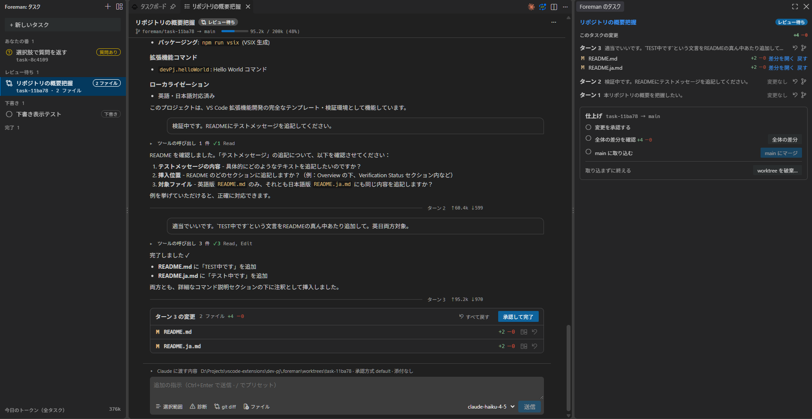
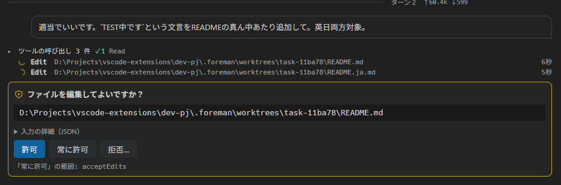
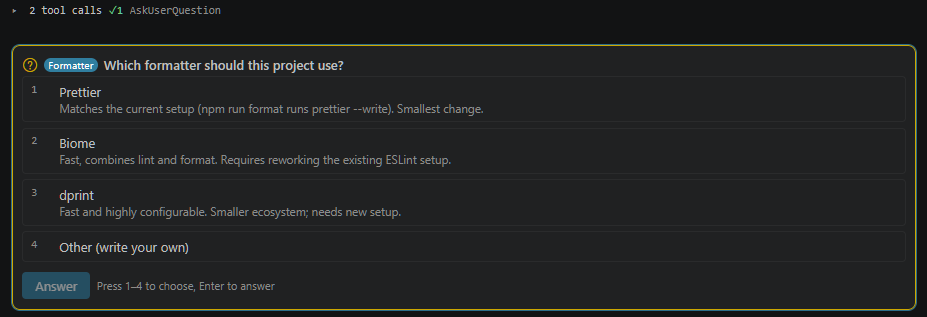
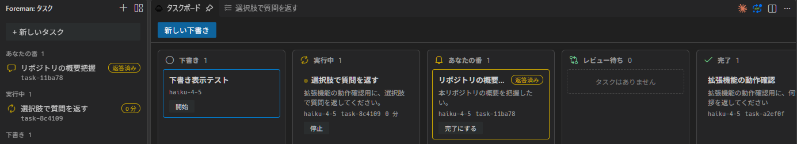

# Foreman for Claude Code

[日本語](README.ja.md)

Run Claude Code sessions as tasks inside Visual Studio Code. Start them side by side and see which one is running or waiting for you. Approve tool calls and review every change turn by turn, with or without Git.

Foreman uses the `claude` CLI that is already installed and logged in on your machine. It works with your own Claude subscription (Pro / Max) or API key. You need neither a GitHub Copilot subscription nor a GitHub sign-in.

## Getting started

1. Open a folder. Foreman runs Claude Code in that folder (the first folder of a multi-root workspace).
2. Click the Foreman icon in the activity bar, then "+" (or run "Foreman: New Task").
3. Type the instruction. In a Git repository, Foreman asks whether to run the task in a worktree.
4. Watch the task in the editor tab. Approve tool calls as they come, review the diff card at the end of a turn, and send follow-ups with Ctrl+Enter (Cmd+Enter on macOS).

To prepare tasks without starting them, open the task board and click "New draft". Right-click a draft to edit or start it.

## Features

- **Tasks, not one chat**: each task is its own Claude Code session. The sidebar groups tasks by what they need: "Your turn" (a tool call to approve, a question to answer, a reply to read, or a failed or interrupted turn), running, review, draft and done. An icon shows each state, and done tasks show when they finished.
- **Task board**: open the board from the sidebar to see the draft, running, "Your turn", review and done columns. Each card has one main action, such as start, stop, open, mark as done, or approve and finish. Right-click a card for the other actions: stop, approve, fork, edit a draft, rename, export, undo an approval, discard a worktree, or delete. The same menu is on the sidebar list, which also offers merge. Drag a draft into "Running" to start it, or a reviewed task into "Done" to approve it.
- **Task view in an editor tab**: streamed output, tool calls and follow-up prompts (Ctrl+Enter). The header shows the state, the main action and a "…" menu, then the branch and the context meter. While Claude works, the running tool and the elapsed time stay on one line, and you can already type your next instruction.
- **Approvals in the task view**: each request asks a plain question, such as "Run this command?", and shows the command or file. Allow it, always allow it in this task (the scope appears below the buttons), or deny it with a reason.
- **Plan first**: turn on "Plan only" next to the input box (or set `foreman.defaultPermissionMode` to `plan`). Claude reads and writes a plan without editing anything, then asks you to approve it. The plan appears as a card, and "Open in editor" shows it as a Markdown preview in an editor tab so you can read a long plan at full size. "Approve and implement" lets Claude continue, and "Deny" with a reason sends it back to planning. Approving the plan turns "Plan only" off.
- **Questions from Claude**: pick a choice with the mouse or the number keys, or write your own answer under "Other". When Claude asks more than one question, switch between them with tabs and send all the answers from the last tab.
- **Diff cards without Git**: every turn shows which files changed and the line counts. Open an inline diff or the Visual Studio Code diff editor. Revert a file with one click, or every file of the latest turn with "Revert all". "Approve and finish" marks the task as done, and you can undo the approval until you merge or discard the worktree. This works in folders that are not Git repositories.
- **Pass along**: the toolbar in the input box attaches the editor selection, the errors and warnings from Problems, the uncommitted `git diff`, or files from a picker. Paste a screenshot from the clipboard to attach it as an image. You can also right-click a file in the Explorer or an editor tab and choose "Attach to Task", right-click in the editor for "Attach Selection to Task", or drop files onto the task view (hold Shift when you drag from the editor area).
- **Model per turn**: pick the model for the next turn in the input box. The list comes from your Claude Code, so it matches your plan and version. If the previous turn ran on a different model, the input box says so.
- **Notifications and status bar**: get a notification when a task needs you, has changes to review, or failed. The status bar counts the running tasks and the tasks that wait for you, shows the model and context usage of the task you are looking at, and opens the task list on click.
- **Prompt presets, commands and Context panel**: type `/fix`, `/test` or `/review` at the start of a prompt to expand a preset (edit them in `foreman.presets`). Keep typing after `/` to filter your Claude Code commands and skills (read from your Claude Code once at startup, matched by prefix on any `:`-separated part), pick one with the arrow keys and Enter, and Claude Code runs it as usual. The "What Claude will receive" line above the input shows the directory, the permission mode and the number of attachments. Open it to see the exact text Foreman will send and the rules you always allowed.
- **Token usage**: the task view and the status bar show how much of the context window the task uses. Each turn shows its input and output tokens, and the sidebar shows today's total for all tasks. When the context grows, the compact icon next to the meter runs `/compact`, and a divider shows how many tokens it freed.
- **Plan usage**: with a Pro or Max plan, the sidebar and the status bar show how much of your 5-hour, 7-day and per-model limits you have used, and the sidebar adds when they reset. Choose what each place shows with `foreman.planUsage.sidebar` and `foreman.planUsage.statusBar`. Foreman reads the figures from your Claude Code at startup, after a turn ends, every 10 minutes, and when you click the refresh icon in the sidebar. Reading them uses none of your limits.
- **Persistence**: tasks, history and diff cards survive a restart. An interrupted task keeps its session, so your next prompt continues it.
- **Git worktrees**: run a task in its own worktree and branch. For a worktree task, the "Finish" section in the secondary side bar walks you through approving the changes, reviewing the whole diff and merging into the branch you started from. You can also discard the worktree there. Worktrees live in `.foreman/worktrees` inside the repository.
- **Checkpoints and forks**: every finished turn is a checkpoint. Hover over the turn divider to rewind the files, or the files and the conversation, to that point, or to fork a new task from it. A worktree task forks from its own branch, and merging the fork brings its changes back into that branch.
- **Changes and checkpoints in the secondary side bar**: the "Foreman Task" view follows the task you are looking at and lists its changes and checkpoints by turn.
- **Export**: save a task as a Markdown file from the "…" menu.

## Screenshots

Approve a tool call. The scope of "always allow" appears below the buttons:

Answer a question from Claude with the mouse or the number keys:

The task board, with one main action per card:

The screenshots show the Japanese display language. The extension follows the display language of Visual Studio Code.

## Requirements

- Visual Studio Code 1.138 or later
- [Claude Code](https://code.claude.com/docs/en/overview) installed and logged in (`claude` on your PATH, or set `foreman.claudePath`)
- A Claude subscription (Pro / Max) or an API key configured for Claude Code

Foreman never reads or stores your credentials. It launches your local `claude` CLI, which handles authentication itself. If the CLI is missing or not logged in, the task stops as failed and shows the reason, such as "Not logged in · Please run /login". Run `claude` in a terminal, log in, and send the prompt again.

## Settings

| Setting | Purpose |
| --- | --- |
| `foreman.claudePath` | Path to the `claude` executable. Leave empty to search `PATH` and `~/.local/bin`. |
| `foreman.defaultModel` | Model for new tasks. Leave empty to use the model Claude Code recommends. See [Models](#models). |
| `foreman.defaultEffort` | Effort for new tasks: `low`, `medium`, `high`, `xhigh` or `max`. Leave empty to follow Claude Code. See [Models](#models). |
| `foreman.defaultPermissionMode` | `default` (the default) asks before every tool call. `acceptEdits` allows file edits automatically. `plan` starts in plan mode. You can switch plan mode on and off per task in the input box. |
| `foreman.notifications` | `all` (the default): waiting for input, changes to review, and failed. `waiting`: waiting for input only. `none`: never. |
| `foreman.useWorktree` | Preselect "in a worktree" when Foreman asks where to run a new task in a Git repository. Default `false`. Foreman asks every time. |
| `foreman.worktreeBranchPrefix` | Prefix for worktree branches. Default `foreman/`. |
| `foreman.autoTitle` / `foreman.titleModel` | Let a small model name new tasks from the first prompt. The default model is `haiku`. |
| `foreman.toolCalls` | `collapsed` (the default) or `expanded`: how tool calls appear in the task view. |
| `foreman.thinking` | `collapsed` (the default) shows a "Thinking…" line while Claude thinks. `hidden` leaves it out. Claude Code hands the thinking text itself only to sessions that Anthropic hosts, so Foreman cannot show it; when it does arrive, it appears as a collapsed line you can open. |
| `foreman.taskViewWidth` | Maximum width of the task view content, in `em`. Default `72`; `0` uses the full width. |
| `foreman.planUsage.sidebar` / `foreman.planUsage.statusBar` | Which parts of the plan usage each place shows: `fiveHour`, `sevenDay`, `models`. Default: all three. An empty list hides it there. |
| `foreman.presets` | Prompt presets used as `/name`. `{input}` is replaced with the rest of the prompt. |

## Models

- **No model set**: leave `foreman.defaultModel` empty, and new tasks use the model that Claude Code recommends. The input box shows it as "Default (Opus 5.5)", for example. When Claude Code starts to recommend a newer model, Foreman uses it without any change.
- **Set a model**: write an alias such as `sonnet`, `opus` or `haiku` in `foreman.defaultModel`. An alias follows new versions of that model as your Claude Code supports them. A full ID such as `claude-sonnet-5` keeps that exact version.
- **Per turn**: to use another model for the next turn, pick it in the input box. The list comes from your Claude Code.
- **Effort**: set how much Claude thinks with the slider next to the model in the input box. The slider has one stop for each level that the model supports, and it hides for models without effort support, such as Haiku. Leave `foreman.defaultEffort` empty to follow Claude Code: the level you saved with `/effort`, or the model default. The slider then shows the level that the session actually uses.
- **Task titles**: a light model writes the title of a new task from its first prompt. It uses `haiku` by default, so it follows new versions of Haiku. Change it with `foreman.titleModel`, or turn it off with `foreman.autoTitle`. Each title uses one short request.

## Desktop notifications

Foreman shows Visual Studio Code notifications and nothing else. For Windows desktop notifications, install [Local Notifier](https://marketplace.visualstudio.com/items?itemName=shou6.vscode-local-notifier) and add its hook command to your Claude Code settings. Foreman tasks run your Claude Code hooks, so the same setup covers tasks started from Foreman.

## How it works

Foreman talks to Claude Code through the official Claude Agent SDK. Each task maps to one Claude Code session, identified by its session ID. Your Claude Code settings, permission rules and hooks apply to Foreman tasks as well. Foreman keeps task data, display history, file snapshots and pasted images in the extension's workspace storage, outside your repository. When you run a task in a worktree, Foreman creates it under `.foreman/worktrees` in the repository and adds `.foreman/` to `.git/info/exclude`, so Git ignores that folder without touching `.gitignore`.

## Pricing and terms

- Foreman is not affiliated with Anthropic. It runs your own Claude Code, under your own plan or API key, and adds no service of its own.
- Every task is a Claude Code session, so tasks that run in parallel each use your plan's limits (or your API credit).
- Naming a new task sends its first prompt to a light model once. Turn this off with `foreman.autoTitle` if you prefer.
- Reading the model list uses none of your limits.

## Privacy

- Foreman sends data to nobody but Anthropic, through your `claude` CLI. It has no telemetry and no server of its own.
- What reaches Claude: your prompts, the attachments you pass along (selection, Problems, `git diff`, files, pasted images), and the first prompt of a task for its title.
- What stays on your machine: tasks, history, snapshots for the diff cards, and pasted images, in the extension's workspace storage. Deleting a task removes them. The session transcript that Claude Code itself keeps in `~/.claude` stays there.

## Known limitations

- Changes made by shell commands (not by the edit tools) show up without their previous content, so you cannot revert them from the diff card.
- A turn that was running when Visual Studio Code closed is not part of the Claude Code conversation. Foreman repeats that instruction when you continue the task.
- The plan usage comes from an experimental Agent SDK API. If a Claude Code update changes it, the meters disappear and everything else keeps working. It is not available with an API key.

## License

[MIT](LICENSE)
